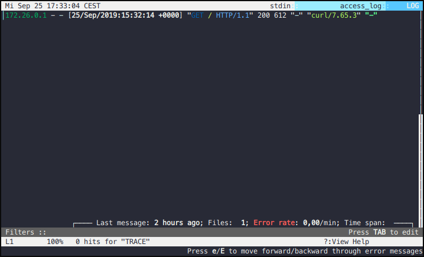

# dclnav

ZSH plugin to open [docker-compose](https://github.com/docker/compose) logs in [lnav](http://lnav.org/).
Plugin itself simply calls `docker-compose logs [service...]`, strips the container name prefix, removes any shell coloring and then pipes the output to lnav.

## How to install
Assuming you're using oh-my-zsh and zsh
Go to your custom plugin directory
```
cd ~/.oh-my-zsh/custom/plugins
```

Get the plugin
```
git clone https://github.com/rsteube/dclnav.git
```

Add dclnav into plugins array, save the file
```
vim ~/.zshrc
```

Restart shell
```
source ~/.zshrc
```

You're ready to use dclnav
```
dclnav nginx
```

## Example

```
docker-compose up -d
curl localhost:8080
dclnav nginx
docker-compose stop
```


